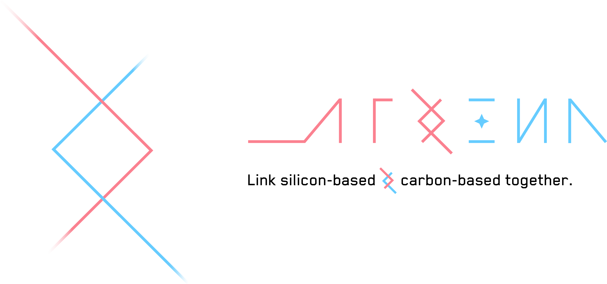

<div align="center">
	

[](https://www.npmjs.com/package/koishi-plugin-yesimbot)
[](LICENSE)


[](https://deepwiki.com/YesWeAreBot/YesImBot)

**机器壳，人类心。**

_让 AI 大模型自然融入群聊的智能机器人系统_

</div>

---

## 这是什么

Athena（YesImBot v4）是一个能够 **长期存在于群聊中，像真人一样自然交流** 的 AI 智能体。

她不是「你问我答」的聊天工具，也不是随叫随到的函数接口。她是一个更接近真实群成员的数字存在——懂得什么时候该说话，什么时候该沉默，什么时候接一句玩笑，什么时候认真回答。

她追求的不是功能齐全，而是 **存在感**、**节奏感** 和 **真实感**。

## 核心特性

- **自主行为决策** —— 不是被动等待 @，而是自己判断何时介入、何时沉默、何时跟进
- **群聊原生体验** —— 或长或短的闲谈、贴合场景的语气、自然的接话和适时的沉默
- **长期记忆与认知** —— 记住你是谁、你的偏好和你们之间的互动历史，越相处越懂你
- **风格自适应** —— 模仿群友的说话风格，理解新词和圈子黑话，不断进化
- **多模型接入** —— 支持 OpenAI、Anthropic Claude、DeepSeek、Google Gemini 等，可混合使用与故障转移
- **工具调用与扩展** —— 搜索、读取链接、运行代码……通过插件系统不断扩展能力边界
- **自定义人格** —— 轻松定制名字、性格、表达风格，塑造独一无二的数字灵魂

> [!NOTE]
> Athena 目前处于 **v4.0.0 beta** 阶段。核心 Agent 运行时和扩展系统已经稳定，API 仍可能演进。详见 [路线图](ROADMAP.md)。

## 设计理念

### 行为先于回答

在群聊里，最难的不是「该说什么」，而是「该不该说」和「怎么说」。Athena 把发言决策视为一等能力——判断时机、控制频率、选择语气——这些比生成一段完美的回答更重要。

沉默、观察、延迟回应、轻量接话、深度展开、跟进补充——这些都是正当行为，不只是「回答问题」才算数。

### 像人，不是像助手

没有人喜欢长篇大论、分点列举的机器人回复。Athena 追求的是或长或短的闲谈、贴合场景的语气、自然的接话和适时的沉默。她不追求完美和高效，她追求的是 **亲切和真实**。

### 成本与时延是设计约束

群聊里，晚到的「正确回答」经常不如及时的「粗糙回应」。Athena 默认走低成本路径（规则 + 意愿值），只在值得的时候升级到 LLM 判断，而不是把每次决策都交给模型。延迟本身就是群聊行为质量的一部分。

### 灵魂来自 Prompt，骨架来自工程

角色感、表达方式和人格质感大量来自 prompt 设计——但系统骨架必须来自清晰的模块边界。Prompt 决定风格，Runtime 决定执行，Session 决定状态，Memory 决定长期认知，Plugin 决定扩展能力。

## 项目结构

Athena 采用 monorepo 架构，核心模块各司其职：

```
Athena/
├── core/              主插件：Koishi 集成、消息路由、业务运行时
├── packages/
│   ├── agent/         Agent 运行时：对话环路、会话管理、扩展系统
│   └── shared-model/  跨包共享类型契约
├── providers/         模型提供商插件（OpenAI / Anthropic / DeepSeek / Google）
├── plugins/           扩展插件（MCP 客户端等）
└── assets/            资源文件
```

| 包名         | npm 名                   | 说明                      |
| ------------ | ------------------------ | ------------------------- |
| core         | `koishi-plugin-yesimbot` | 主运行时插件，Koishi 集成 |
| agent        | `@yesimbot/agent`        | 通用 Agent 运行时框架     |
| shared-model | `@yesimbot/shared-model` | 跨包共享类型定义          |

## 快速了解

| 想要了解           | 阅读                                                                                  |
| ------------------ | ------------------------------------------------------------------------------------- |
| 项目愿景与设计理念 | [vision-and-evolution-notes](docs/2026-05-04-athena-v4-vision-and-evolution-notes.md) |
| 当前开发进度       | [ROADMAP.md](ROADMAP.md)                                                              |
| 更新日志           | [CHANGELOG.md](CHANGELOG.md)                                                          |
| 详细文档站         | [docs.yesimbot.chat](https://docs.yesimbot.chat/)                                     |

## 社区与支持

- 问题反馈：[GitHub Issues](https://github.com/YesWeAreBot/YesImBot/issues)
- QQ 交流群：[857518324](http://qm.qq.com/cgi-bin/qm/qr?_wv=1027&k=k3O5_1kNFJMERGxBOj1ci43jHvLvfru9&authKey=TkOxmhIa6kEQxULtJ0oMVU9FxoY2XNiA%2B7bQ4K%2FNx5%2F8C8ToakYZeDnQjL%2B31Rx%2B&noverify=0&group_code=857518324)

## 贡献者

感谢所有为 Athena 付出努力的人：


## Star 趋势

<div align="center">

<a href="https://www.star-history.com/?repos=vmoranv%2Fjshookmcp&type=date&legend=top-left">
 <picture>
   <source media="(prefers-color-scheme: dark)" srcset="https://api.star-history.com/image?repos=YesWeAreBot/YesImBot&type=date&legend=top-left" />
   <source media="(prefers-color-scheme: light)" srcset="https://api.star-history.com/image?repos=YesWeAreBot/YesImBot&type=date&legend=top-left" />
   
 </picture>
</a>


</div>

---

<div align="center">

**Code is open, but the soul is yours.**

_让 AI 更像人类，让聊天更有温度_

</div>
